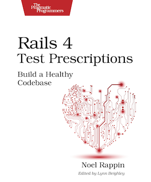

```
Roberto Nogueira  BSd EE, MSd CE
Solution Integrator Experienced - Certified by Ericsson
```

# Rails 4 Test Prescriptions



**About**

Does your Rails code suffer from bloat, brittleness, or inaccuracy? Cure these problems with a regular dose of test-driven development. `Rails 4 Test Prescriptions` is a comprehensive guide to how tests can help you design and write better Rails applications. In this completely revised edition, you’ll learn why testing works and how to test effectively using Rails 4, Minitest 5, and RSpec 3, as well as popular testing libraries such as factory_girl and Cucumber. Do what the doctor ordered to make your applications feel all better. Side effects may include better code, fewer bugs, and happier developers.

[homepage](https://pragprog.com/book/nrtest2/rails-4-test-prescriptions)

## Contents

```
Table of Contents

A Testing Fable
[ ] Who You Are
[ ] The Power of Testing First
[ ] What Is TDD Good For?
[ ] When TDD Needs Some Help
[ ] Words to Live By
[ ] A Word About Tools, Best Practices, and Teaching TDD
[ ] Coming Up Next
[ ] Changes for the Second Edition
Test-Driven Development Basics excerpt
[ ] Infrastructure
[ ] The Requirements
[ ] Where to Start?
[ ] Running Our test
[ ] Passing Our Test
[ ] The Second Test
[ ] Our First Date
[ ] Using the Time Data
[ ] What We’ve Done
Test-Driven Rails
[ ] And Now, Let’s Write Some Rails
[ ] The Days Are Action Packed
[ ] Who Controls the Controller?
[ ] A Test With A View
[ ] What Have We Done? And What’s Next?
What Makes Great Tests
[ ] The Big One
[ ] The Big Two
[ ] The More Detailed Five: SWIFT Tests
Testing Models
[ ] What Can We Do In A Model Test?
[ ] What Should I Test in a Model Test?
[ ] Okay, Funny Man, What Makes a Good Set of Model Tests?
[ ] Refactoring Models
[ ] A Note on Assertions Per Test
[ ] Testing What Rails Gives You
[ ] Testing ActiveRecord Finders
[ ] Modeling Data
Adding Data To Tests
[ ] What’s the Problem?
[ ] Fixtures
[ ] Factories
[ ] Dates and Times
[ ] Summary
Using Mock Objects
[ ] Mock Objects Defined
[ ] Installing Mocha
[ ] Creating Stubs in Mocha
[ ] Mock Expectations
[ ] Using Mocks To Simulate Rails Save
[ ] Using Mocks To Specify Behavior
[ ] More Expectation Annotations
[ ] Mock Tips
[ ] Coming Up Next
Testing Controllers And Views excerpt
[ ] Testing Controllers
[ ] Simulating Requests in a Controller Test
[ ] Evaluating Controller Results
[ ] Testing Routes
[ ] View Tests
[ ] Testing Helper Methods
[ ] Testing View Markup
[ ] Presenters
[ ] Testing Mailers
[ ] Managing Controller and View Tests
Driving Behavior With RSpec
[ ] Getting Started With RSpec
[ ] RSpec in 10 Minutes
[ ] The “It” Factor
[ ] Great “Expect”ations
[ ] Mocking RSpec
[ ] Let RSpec Eat Cake
[ ] RSpec On Rails
[ ] RSpec and Models
[ ] Controllers in RSpec
[ ] RSpec and Views
[ ] RSpec Routing Tests
[ ] RSpec and Helpers
[ ] Write Your Own RSpec Matchers
[ ] RSpec and Sharing
[ ] Data About Metadata
[ ] What’s Next
Integration Testing with Capybara and Cucumber
[ ] What to Test in an Integration Test
[ ] Setting up Capybara
[ ] Outside in Testing
[ ] Using Capybara
[ ] Making the Capybara Test Pass
[ ] Retrospective
[ ] Cucumber
[ ] Setting Up Cucumber
[ ] Writing Cucumber Features
[ ] Writing Cucumber Steps
[ ] More Advanced Cucumber
[ ] Is Cucumber Worth It?
[ ] Looking Ahead
Testing JavaScript
[ ] Unit Testing JavaScript
[ ] Integration Testing With JavaScript
Testing External Services
Testing For Security
[ ] User Authentication and Authorization
Troubleshooting and Debugging
Improving Your Test Environment
[ ] Running Smaller Groups of Tests
[ ] Making Faster Tests
Testing Legacy Code
```
